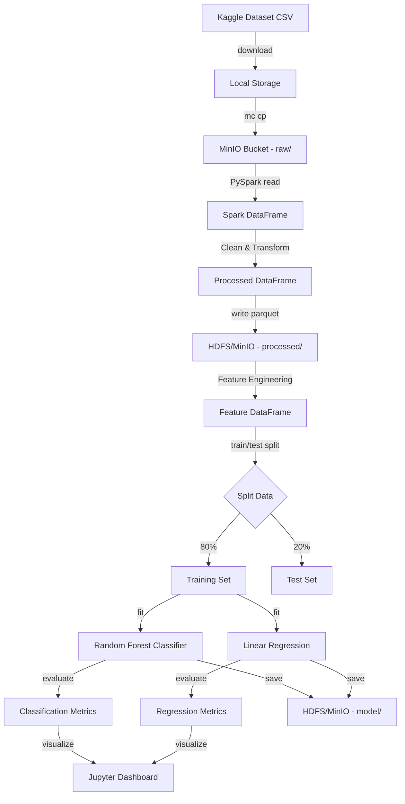

# 🏗️ Arsitektur Ekosistem Big Data
## Proyek Analisis Performa Kampanye Marketing

---

## 1. Diagram Arsitektur

```
┌─────────────────────────────────────────────────────────────────────────────┐
│                        EKOSISTEM BIG DATA                                   │
│                                                                             │
│  ┌─────────────┐                                                            │
│  │   KAGGLE     │  Dataset CSV                                              │
│  │  (Sumber)    │──────────┐                                                │
│  └─────────────┘           │                                                │
│                            ▼                                                │
│  ┌─────────────────────────────────────┐                                    │
│  │         DATA LAKE (MinIO)           │                                    │
│  │                                     │                                    │
│  │  📁 marketing-data/                 │                                    │
│  │  ├── raw/         ← CSV mentah      │                                    │
│  │  ├── processed/   ← Parquet bersih  │                                    │
│  │  └── model/       ← Model ML        │                                    │
│  └──────────────┬──────────────────────┘                                    │
│                 │                                                            │
│                 ▼                                                            │
│  ┌─────────────────────────────────────┐                                    │
│  │      HDFS (Distributed Storage)     │                                    │
│  │                                     │                                    │
│  │  /user/hadoop/marketing/            │                                    │
│  │  ├── raw/         ← CSV dari MinIO  │                                    │
│  │  ├── processed/   ← Parquet         │                                    │
│  │  └── model/       ← Model tersimpan │                                    │
│  │                                     │                                    │
│  │  NameNode (1) + DataNode (2+)       │                                    │
│  └──────────────┬──────────────────────┘                                    │
│                 │                                                            │
│                 ▼                                                            │
│  ┌─────────────────────────────────────┐                                    │
│  │      APACHE SPARK (Processing)      │                                    │
│  │                                     │                                    │
│  │  ┌───────────────┐  ┌────────────┐  │                                    │
│  │  │  Spark SQL    │  │ DataFrame  │  │                                    │
│  │  │  (Query)      │  │ API (ETL)  │  │                                    │
│  │  └───────────────┘  └────────────┘  │                                    │
│  │                                     │                                    │
│  │  ┌───────────────────────────────┐  │                                    │
│  │  │        SPARK MLLIB            │  │                                    │
│  │  │                               │  │                                    │
│  │  │  ┌─────────────────────────┐  │  │                                    │
│  │  │  │ Random Forest Classifier│  │  │                                    │
│  │  │  │ (Klasifikasi ROI)       │  │  │                                    │
│  │  │  └─────────────────────────┘  │  │                                    │
│  │  │                               │  │                                    │
│  │  │  ┌─────────────────────────┐  │  │                                    │
│  │  │  │ Linear Regression       │  │  │                                    │
│  │  │  │ (Prediksi Revenue)      │  │  │                                    │
│  │  │  └─────────────────────────┘  │  │                                    │
│  │  └───────────────────────────────┘  │                                    │
│  └──────────────┬──────────────────────┘                                    │
│                 │                                                            │
│                 ▼                                                            │
│  ┌─────────────────────────────────────┐                                    │
│  │   JUPYTER NOTEBOOK (Visualization)  │                                    │
│  │                                     │                                    │
│  │  📊 Matplotlib + Seaborn + Plotly   │                                    │
│  │  📈 Confusion Matrix               │                                    │
│  │  📉 Feature Importance             │                                    │
│  │  📋 Actual vs Predicted            │                                    │
│  └─────────────────────────────────────┘                                    │
└─────────────────────────────────────────────────────────────────────────────┘
```

---

## 2. Komponen Teknologi

### 2.1 Data Ingestion Layer
| Komponen | Teknologi | Deskripsi |
|----------|-----------|-----------|
| Sumber Data | Kaggle API | Download dataset CSV dari Kaggle |
| Upload ke Data Lake | MinIO Client (mc) | Upload CSV ke MinIO bucket |
| Upload ke HDFS | PySpark / hadoop fs | Transfer data dari MinIO ke HDFS |

### 2.2 Storage Layer
| Komponen | Teknologi | Deskripsi |
|----------|-----------|-----------|
| Data Lake | MinIO | Object storage S3-compatible untuk raw data |
| Distributed Storage | HDFS | Penyimpanan terdistribusi untuk processing |
| Format Data | CSV → Parquet | Konversi ke format kolumnar untuk efisiensi |

### 2.3 Processing Layer
| Komponen | Teknologi | Deskripsi |
|----------|-----------|-----------|
| ETL Engine | Apache Spark | Pembersihan, transformasi, dan feature engineering |
| Query Engine | Spark SQL | Analisis data menggunakan SQL |
| DataFrame API | PySpark | Manipulasi data terdistribusi |

### 2.4 Analytics Layer
| Komponen | Teknologi | Deskripsi |
|----------|-----------|-----------|
| ML Framework | Spark MLlib | Library ML terdistribusi |
| Klasifikasi | Random Forest | Prediksi profitabilitas kampanye |
| Regresi | Linear Regression | Prediksi Revenue_USD |
| Tuning | CrossValidator | Hyperparameter optimization |

### 2.5 Visualization Layer
| Komponen | Teknologi | Deskripsi |
|----------|-----------|-----------|
| Notebook | Jupyter / JupyterLab | Interactive computing environment |
| Charting | Matplotlib + Seaborn | Static visualization |
| Interactive | Plotly | Interactive charts |

---

## 3. Data Flow Pipeline



---

## 4. Environment Requirements

### Hardware Minimum
- **RAM:** 8 GB (16 GB recommended)
- **CPU:** 4 cores
- **Storage:** 20 GB free space

### Software Stack
| Software | Version | Purpose |
|----------|---------|---------|
| Java JDK | 8 atau 11 | Runtime untuk Spark & Hadoop |
| Python | 3.8+ | Bahasa pemrograman utama |
| Apache Spark | 3.3+ | Processing engine |
| Apache Hadoop | 3.3+ | Distributed storage (HDFS) |
| MinIO | Latest | Object storage (Data Lake) |
| Jupyter | 1.0+ | Notebook environment |

### Python Libraries
| Library | Purpose |
|---------|---------|
| pyspark | Spark Python API |
| pandas | Data manipulation |
| numpy | Numerical computing |
| matplotlib | Static visualization |
| seaborn | Statistical visualization |
| plotly | Interactive visualization |
| minio | MinIO Python client |
